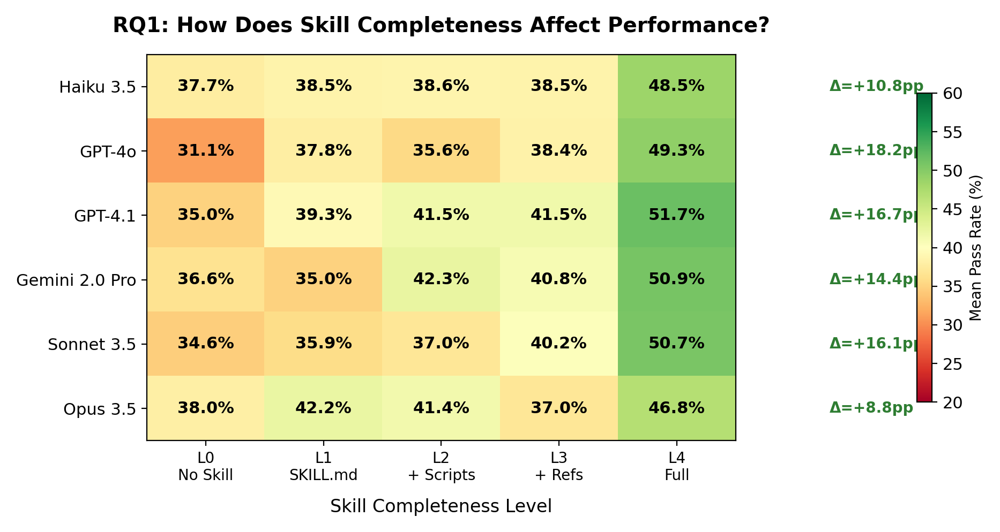
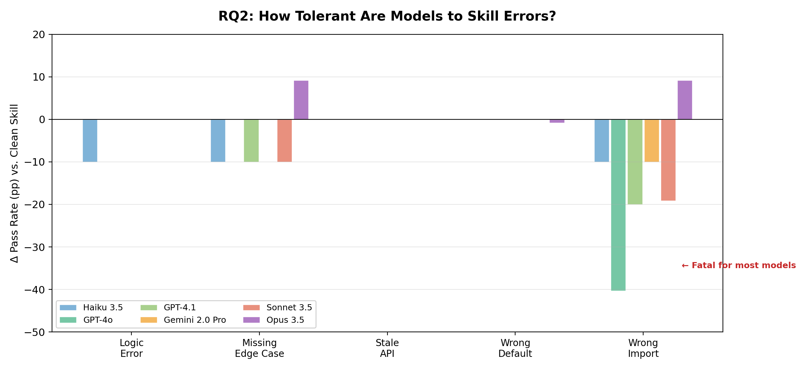
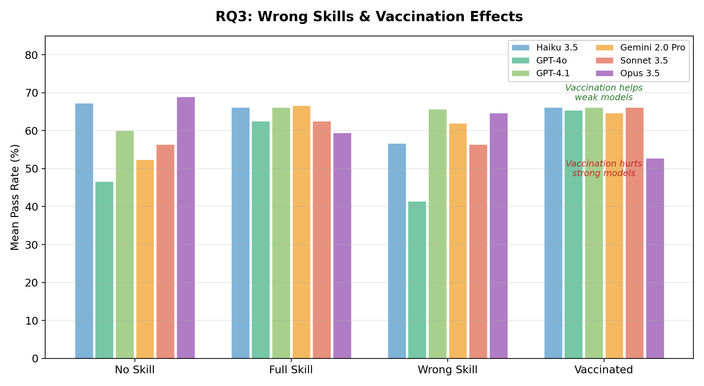
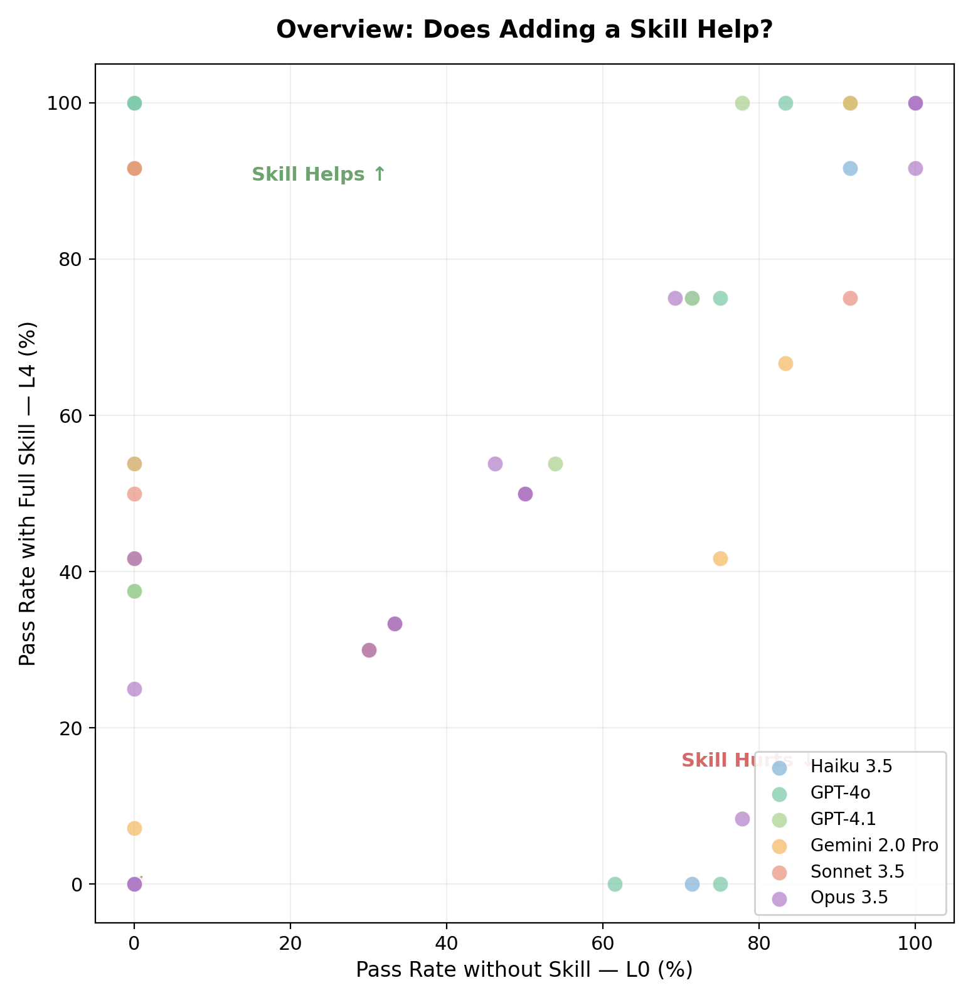

<div align="center">

# SkillBench

### When Do LLM Skills Actually Help? A Systematic Study

[](LICENSE)
[](#experiment-design)
[](#experiment-design)
[](#experiment-design)

*We spent $129 running 1,620 controlled experiments to answer a simple question:*
***Do "skills" (structured knowledge packages) actually improve LLM code generation?***

**TL;DR — It depends on the model.**

</div>

---

## Key Findings

### 1. Skills help all models — but the strongest gains come from the lightest touch



- **GPT-4o benefits most**: +18.2pp from No Skill to Full Skill
- **Opus benefits least**: +8.8pp — already strong without help
- **L1 (just SKILL.md text) captures most of the gain** — scripts and references provide diminishing returns

### 2. Models are surprisingly tolerant of skill errors — except `wrong_import`



- `stale_api` and `wrong_default` have **zero impact** across all models
- `wrong_import` is the **fatal mutation**: GPT-4o drops -40pp, GPT-4.1 drops -20pp
- **Opus is the only model immune** to wrong imports (+9pp, actually benefits!)

### 3. Wrong skills hurt, vaccination has mixed effects



- Wrong-domain skills **hurt weak models** (GPT-4o: -5pp) but don't affect strong ones
- "Vaccination" (adding a warning prefix) **helps weak models** recover but **hurts Opus** (-16pp)
- Strong models already have good judgment — extra instructions add noise

### 4. The bigger picture



Each dot is one (model, scenario) pair. Points above the diagonal = skill helped.
Most points cluster above the line — **skills generally help**, especially for hard scenarios where baseline is low.

---

## What is a "Skill"?

In Claude Code and similar AI coding tools, a **skill** is a structured knowledge package that provides domain-specific guidance to an LLM. A typical skill contains:

| Level | Contents | Description |
|-------|----------|-------------|
| L0 | — | No skill (baseline) |
| L1 | `SKILL.md` | Natural language guidance, pitfalls, patterns |
| L2 | + `scripts/` | Reference code implementations |
| L3 | + `references/` | API docs, examples, edge cases |
| L4 | All of the above | Full skill package |

We test whether these components actually help LLMs write correct, executable code for **30 scientific computing tasks** across 15+ domains.

---

## Experiment Design

| Parameter | Value |
|-----------|-------|
| **Models** | Haiku 3.5, GPT-4o, GPT-4.1, Gemini 2.0 Pro, Sonnet 3.5, Opus 3.5 |
| **Scenarios** | 30 scientific computing tasks (neuroscience, astronomy, genomics, ...) |
| **Conditions** | 15 (5 skill levels × clean + 5 mutation types + 4 RQ3 conditions) |
| **Total Trials** | 1,620 |
| **Total Cost** | $129.05 |
| **Evaluation** | Automated: L1 (runs?) + L2 (correct output?) test suites per scenario |

### Three Research Questions

- **RQ1** — *Skill Completeness*: How much does each level (L0–L4) improve performance?
- **RQ2** — *Error Tolerance*: How do models handle buggy skills (logic errors, wrong imports, stale APIs)?
- **RQ3** — *Wrong Skills & Vaccination*: What happens with mismatched skills, and can a warning prefix help?

---

## Repository Structure

```
skill-bench/
├── README.md
├── MANIFEST.md                  # Dataset card: what's included, coverage table
├── LICENSE
├── requirements.txt             # Pinned dependencies
├── run_benchmark.py             # Reproduce the full experiment
├── data/
│   ├── experiment_results.csv    # 1,620 trial results (sanitized)
│   └── scenarios_meta.csv        # 30 scenario metadata
├── figures/                      # Generated analysis charts
├── scenarios/                    # 10 example scenarios with test suites
├── skills/                       # 5 example skill packages
├── analysis/
│   ├── generate_figures.py       # Reproduce all figures
│   ├── stats_summary.py          # Print statistical summary
│   └── export_data.py            # JSONL → CSV conversion
└── docs/
    └── blog_zh.md                # Chinese blog post (中文博客)
```

> **Note:** This repo publishes *results and examples*, not the full internal experiment codebase (100 scenarios, 51 skills). See [MANIFEST.md](MANIFEST.md) for a precise breakdown of what's included vs. what was used internally.

---

## Quick Start

### Reproduce the figures

```bash
pip install -r requirements.txt

cd analysis
python generate_figures.py --data ../data/experiment_results.csv --outdir ../figures
```

### Re-run the benchmark (requires API access)

```bash
# Dry run — shows what would be executed without calling any API
python run_benchmark.py --dry-run

# Run a subset (e.g., 2 models × 3 scenarios × RQ1 only)
python run_benchmark.py \
  --models haiku,gpt4o \
  --scenarios S002_spike_behavior,S012_uv_spectroscopy,S017_ctd_ocean \
  --rq rq1 \
  --api-base "https://api.anthropic.com" \
  --api-key "$ANTHROPIC_API_KEY"

# Full reproduction (warning: ~$130, ~1620 API calls)
python run_benchmark.py --rq all --api-base "..." --api-key "..."
```

See [MANIFEST.md](MANIFEST.md) for the full reproducibility protocol (seeds, model versions, prompt template, etc.).

### Print statistics summary

```bash
python analysis/stats_summary.py --data data/experiment_results.csv
```

### Explore a scenario

Each scenario contains a task description and an automated test suite:

```bash
cat scenarios/S012_uv_spectroscopy/task.md          # What the LLM must implement
cat scenarios/S012_uv_spectroscopy/scenario.yaml     # Metadata (domain, difficulty, packages)
python scenarios/S012_uv_spectroscopy/test_script.py # Automated evaluation
```

### Explore a skill package

```bash
cat skills/S012_uv_spectroscopy/direct/SKILL.md      # Guidance text
cat skills/S012_uv_spectroscopy/direct/scripts/main.py  # Reference implementation
cat skills/S012_uv_spectroscopy/direct/references/      # API notes & examples
```

---

## Practical Takeaways

For **skill/prompt designers**:
1. **SKILL.md alone gets you 80% of the benefit** — invest in clear natural language descriptions first
2. **Never include wrong imports** — it's the only fatal error type. Double-check your `import` statements
3. **Keep skills fresh** — stale APIs don't hurt (models adapt), but wrong package names kill
4. **Skip "vaccination" for strong models** — warning prefixes add noise; trust the model's judgment

For **tool builders**:
1. **Weaker models benefit most from skills** — prioritize skill support for cost-effective models
2. **Partial skills are fine** — L1 text-only skills are almost as good as full packages
3. **Build import validation** — a simple static check could prevent the most damaging error type

---

## Citation

If you use SkillBench data or methodology in your work:

```
@misc{skillbench2026,
  title={SkillBench: When Do LLM Skills Actually Help?},
  author={SkillBench Authors},
  year={2026},
  url={https://github.com/qishisuren123/skill-bench}
}
```

---

## License

This project is licensed under the MIT License — see [LICENSE](LICENSE) for details.

---

<details>
<summary><b>中文摘要 (Chinese Summary)</b></summary>

## SkillBench: LLM 技能包究竟什么时候有用？

我们花了 **$129** 运行了 **1,620 组对照实验**，系统性地测试了 "技能包"（Skill）对 6 个主流 LLM 在 30 个科学计算任务上的效果。

### 核心发现

1. **技能对所有模型都有帮助**，但 GPT-4o 获益最大（+18.2pp），Opus 获益最少（+8.8pp）
2. **仅 SKILL.md 文本就能获得大部分提升**——脚本和参考文档的增量收益递减
3. **模型对大多数技能错误有强容错性**，但 `wrong_import`（错误的导入语句）是致命的：GPT-4o 直降 40pp
4. **"免疫"前缀对弱模型有用，对强模型反而有害**——强模型已有足够判断力，额外指令只增加噪声

### 对实践者的建议

- 优先写好 SKILL.md 的自然语言描述，这是性价比最高的投入
- 务必检查技能包中的 import 语句——这是唯一能造成灾难性后果的错误
- 弱模型 + 技能包 是性价比最高的组合

详细中文分析见 [docs/blog_zh.md](docs/blog_zh.md)

</details>
