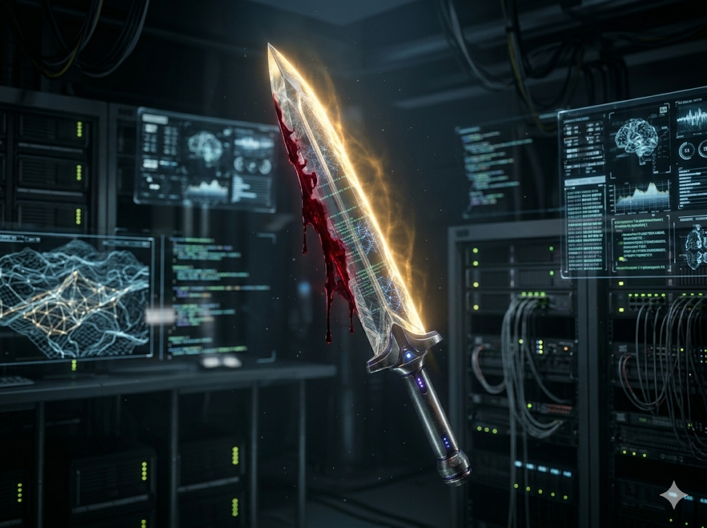
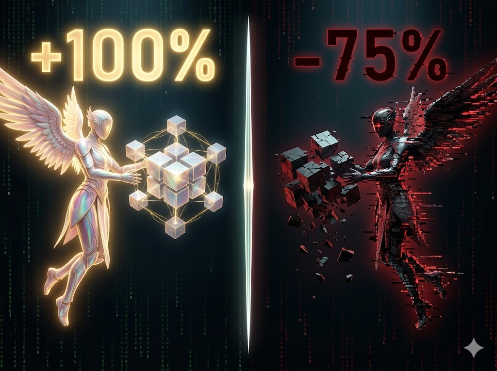
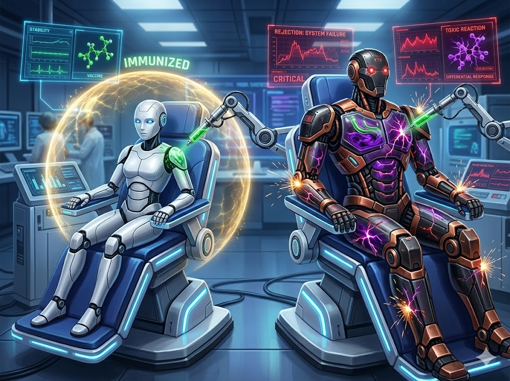
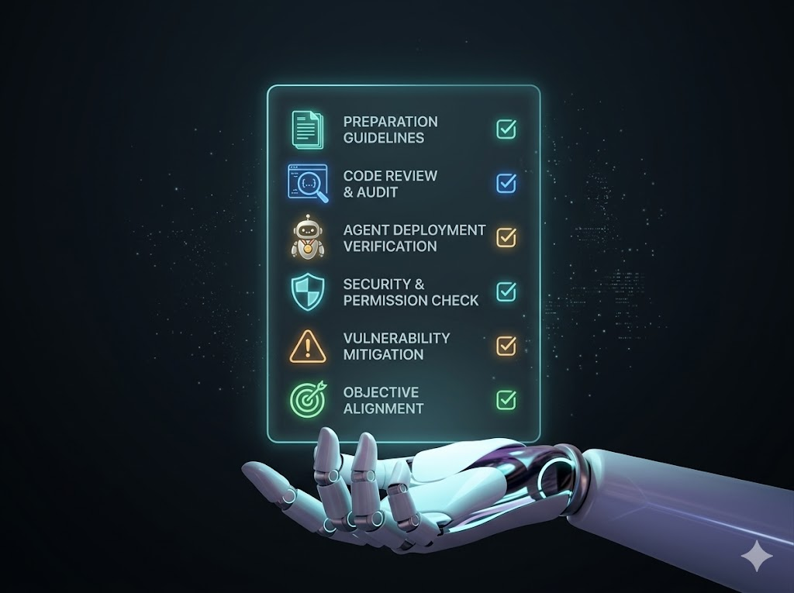

# 1620 组实验揭示：AI 编程的「技能包」是一把双刃剑

> 一项系统性实验，揭示了 AI 编程助手中"技能"功能的真实效果。

---

**图 1：封面**

如果你用过 Claude Code、Cursor 或其他 AI 编程工具，你可能注意到了一个功能叫 **"Skills"（技能包）**——它本质上是一份结构化的领域知识文档，告诉 AI "遇到这类任务该怎么做"。

**但它真的有用吗？什么时候有用？什么时候反而有害？**

我们设计了一场大规模受控实验：**6 个主流大模型 × 30 个科学计算任务 × 15 种实验条件 = 1,620 组试验**。

以下是我们发现的 7 个反直觉结论。

---

**图 2：弱者逆袭，强者无感**

给 6 个主流大模型加上同样的"技能包"，结果令人震惊：

- 最弱的 GPT-4o 提升了 **+7.3 个百分点**——技能直接教会了它原本不会的东西
- 最强的 Opus 只提升了 **+0.1pp**——它根本不需要你的帮助
- 而 Haiku 反而被技能"带歪了"，**下降了 -0.5pp**

技能是穷人的武器，不是富人的奢侈品。

与其花钱升级模型，不如花时间写好技能文档——便宜模型 + 好技能 ≈ 贵模型的效果。

---

**图 3：唯一的致命弱点**

我们在技能包里埋了 5 种常见错误，测试 AI 的容错能力：

| 错误类型 | 影响 |
|---------|------|
| 过时 API | 完全免疫（0pp） |
| 错误默认值 | 几乎无影响（-0.1pp） |
| 逻辑错误 | 轻微（-3pp） |
| 遗漏边界 | 轻微（-3pp） |
| **错误 import** | **致命！（-15pp，GPT-4o 暴跌 -40pp）** |

看图中城堡底部那扇碎裂的 "import" 窗——所有城墙固若金汤，只有这一扇是纸糊的。

实操建议：发布任何 AI 技能/Prompt 之前，花 30 秒检查 import 语句。这是唯一能造成灾难的错误。

---

**图 4：同一把剑，天使与魔鬼**

最震撼的发现——同一个模型，同一套技能系统：

- GPT-4o 做「海洋数据处理」：**0% → 100%**，技能直接封神
- GPT-4o 做「天气锋面分析」：**75% → 0%**，技能直接团灭

Haiku 做「地震目录」：没技能时它是 6 个模型中唯一能做对的，加了技能后直接归零。

技能不是"万能药"，它是一把手术刀——用对位置是救命，用错位置是致命。

---

**图 5：大一统器**

没有技能时，6 个模型各显神通，差异巨大。
加了技能后，所有模型被"拉平"——**跨模型差异下降了 64%**。

这意味着：
- 便宜模型 + 好技能 ≈ 贵模型
- 贵模型 + 技能 ≈ 没有额外收益
- **技能的真正价值不是"让强者更强"，而是"让弱者变强"**

---

**图 6：二元世界**

1620 次实验中：
- **36% 完全通过**（满分）
- **32% 完全失败**（零分）
- 只有 **31% 是部分通过**

AI 编程不是一个连续光谱，而是一个二元世界——要么完全理解，要么完全不理解。

而 30 个任务中，有 **11 个（37%）在任何模型、任何条件下都从未被解决过**。

AI 的能力边界比我们想象的更清晰、更绝对。

---

**图 7：免疫反噬**

我们试着在技能前加一句"请批判性参考，以下内容可能不准确"——像给 AI 打一针"疫苗"。

结果：
- 弱模型（GPT-4o）：疫苗有效！从 47% 恢复到 **65%**
- 强模型（Opus）：疫苗反噬！从 69% 暴跌到 **53%（-16pp）**

为什么？弱模型本来就无脑复制技能内容，一句提醒帮它建立了批判性。但强模型本来就有好的判断力，额外的怀疑指令让它过度犹豫。

**对弱模型要"提醒"，对强模型要"信任"。**

---

**图 8：6 条实操建议**

1. **写好纯文本技能描述就够了** — 80% 的收益来自一个 Markdown 文件
2. **一定要检查 import 语句** — 唯一的致命错误类型
3. **弱模型 + 好技能 = 性价比之王**
4. **强模型不需要"免疫前缀"** — 信任它的判断力
5. **技能不是万能的** — 37% 的任务无论如何都做不到
6. **关注具体任务** — 平均分会骗人，同一技能在不同场景差距可达 175pp

---

**图 9：开源**

完整数据和代码已开源：
**github.com/qishisuren123/skill-double-edge**

1,620 组实验 | 6 个模型 | 30 个科学计算任务 | 15 种实验条件

如果这个实验对你有帮助，欢迎 star 支持！

---

#AI编程 #大模型 #LLM #ClaudeCode #GPT4o #Opus #技能包 #AI工具测评 #开发者 #科学计算 #程序员 #人工智能 #大模型评测 #效率工具 #开源项目 #Prompt工程
